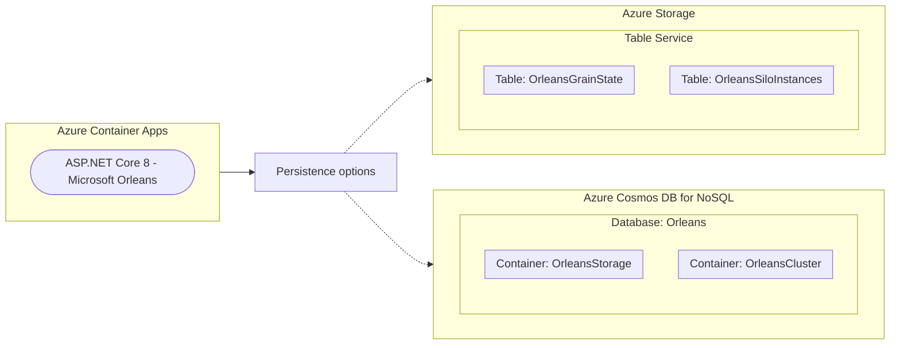

# URL Shortener using Microsoft Orleans and Azure for hosting and data

[](https://codespaces.new/Azure-Samples/orleans-url-shortener?quickstart=1)

This is an ASP.NET Core 8.0 web application to illustrate basic Microsoft Orleans concepts; such as working with Grains, Silos, and persistent state. This web application can be configured to work with [in-memory](https://learn.microsoft.com/dotnet/api/orleans.hosting.memorygrainstoragesilobuilderextensions.addmemorygrainstorage), [Azure Cosmos DB for NoSQL](https://learn.microsoft.com/dotnet/orleans/grains/grain-persistence/azure-cosmos-db), or [Azure Table Storage](https://learn.microsoft.com/dotnet/orleans/grains/grain-persistence/azure-storage) data persistence options. The web application is designed to be hosted using a Docker container in [Azure Contianer Apps](https://learn.microsoft.com/azure/container-apps/).

When you are finished, you will have a simple URL shortner utilty web application deployed to Azure.

### Prerequisites

> This template will create infrastructure and deploy code to Azure. If you don't have an Azure Subscription, you can sign up for a [free account here](https://azure.microsoft.com/free/). Make sure you have the contributor role in the Azure subscription.

The following prerequisites are required to use this template. Please ensure that you have them all installed locally.

- [Azure Developer CLI](https://aka.ms/azd-install)
- [.NET SDK 8.0](https://dotnet.microsoft.com/download/dotnet/8.0)
- [Docker Desktop](https://www.docker.com/products/docker-desktop/)

### Quickstart

To learn how to get started with any template, follow the steps in [this Microsoft Orleans quickstart](https://learn.microsoft.com/dotnet/orleans/quickstarts/deploy-scale-orleans-on-azure) with this template (`orleans-url-shortener`).

This quickstart will show you how to authenticate on Azure, initialize the template, implement data storage in Azure, provision infrastructure, and deploy code on Azure via the following commands:

```bash
# Log in to azd. Only required once per-install.
azd auth login

# First-time project setup. Initialize a project in the current directory, using this template.
# Omit the --template argument if you are running in a development container.
azd init --template orleans-url-shortener

# Provision and deploy to Azure
azd up
```

#### Deploying Azure Table Storage and Azure Cosmos DB for NoSQL

Azure data persistence is **opt-in** for this template. By default, the template will not deploy and Azure data service. Follow these steps to configure data persistence in Azure.

1. To deploy an Azure data service, configure the `DEPLOY_AZURE_COSMOS_DB_NOSQL` or `DEPLOY_AZURE_TABLE_STORAGE` environment variables. By default, these environment variables are set to `false`.

    ```bash
    # Enables deployment of Azure Cosmos DB for NoSQL resource
    azd env set DEPLOY_AZURE_COSMOS_DB_NOSQL true

    # Enables deployment of Azure Table Storage resource
    azd env set DEPLOY_AZURE_TABLE_STORAGE true

    # Reprovision architecture and deploy Bicep template again
    azd provision
    ```

1. Add the correct package for the data persistence and clustering option you prefer.

    - **Azure Cosmos DB for NoSQL persistence**

    | Azure data service | Type | NuGet package |
    | --- | --- | --- |
    | Azure Cosmos DB | Clustering | [`Microsoft.Orleans.Clustering.Cosmos`](https://www.nuget.org/packages/Microsoft.Orleans.Clustering.Cosmos) |
    | Azure Cosmos DB | Persistence | [`Microsoft.Orleans.Persistence.Cosmos`](https://www.nuget.org/packages/Microsoft.Orleans.Persistence.Cosmos) |

    ```bash
    # Add identity package
    dotnet add package Azure.Identity

    # Azure Cosmos DB for NoSQL data persistence and clustering grains
    dotnet add package Microsoft.Orleans.Clustering.Cosmos
    dotnet add package Microsoft.Orleans.Persistence.Cosmos
    ```

    - **Azure Table Storage persistence**

    | Azure data service | Type | NuGet package |
    | --- | --- | --- |
    | Azure Table Storage | Clustering | [`Microsoft.Orleans.Clustering.AzureStorage`](https://www.nuget.org/packages/Microsoft.Orleans.Clustering.AzureStorage) |
    | Azure Table Storage | Persistence | [`Microsoft.Orleans.Persistence.AzureStorage`](https://www.nuget.org/packages/Microsoft.Orleans.Persistence.AzureStorage) |

    ```bash
    # Add identity package
    dotnet add package Azure.Identity

    # Azure Table Storage data persistence and clustering grains
    dotnet add package Microsoft.Orleans.Clustering.AzureStorage
    dotnet add package Microsoft.Orleans.Persistence.AzureStorage
    ```

1. Configure the template's code in the *src/Web/Program.cs* file to enable your preferred choice of data persistence.

    - **Azure Cosmos DB for NoSQL persistence**

        ```csharp
        using Azure.Identity;
        using Orleans.Configuration;
        ```

        ```csharp
        if (builder.Environment.IsDevelopment())
        {
            builder.Host.UseOrleans(static siloBuilder =>
            {
                siloBuilder
                    .UseLocalhostClustering()
                    .AddMemoryGrainStorage("urls");
            });
        }
        else
        {
            builder.Host.UseOrleans(siloBuilder =>
            {
                var endpoint = builder.Configuration["AZURE_COSMOS_DB_NOSQL_ENDPOINT"]!;
                var credential = new DefaultAzureCredential();

                siloBuilder
                    .UseCosmosClustering(options =>
                    {
                        options.ConfigureCosmosClient(endpoint, credential);
                    })
                    .AddCosmosGrainStorage(name: "urls", options =>
                    {
                        options.ConfigureCosmosClient(endpoint, credential);
                    })
                    .Configure<ClusterOptions>(options =>
                    {
                        options.ClusterId = "url-shortener";
                        options.ServiceId = "urls";
                    });
            });
        }
        ```

    - **Azure Table Storage persistence**

        ```csharp
        using Azure.Identity;
        using Orleans.Configuration;
        ```

        ```csharp
        if (builder.Environment.IsDevelopment())
        {
            builder.Host.UseOrleans(static siloBuilder =>
            {
                siloBuilder
                    .UseLocalhostClustering()
                    .AddMemoryGrainStorage("urls");
            });
        }
        else
        {
            builder.Host.UseOrleans(siloBuilder =>
            {
                var endpoint = new Uri(builder.Configuration["AZURE_COSMOS_DB_NOSQL_ENDPOINT"]!);
                var credential = new DefaultAzureCredential();

                siloBuilder
                    .UseAzureStorageClustering(options =>
                    {
                        options.ConfigureTableServiceClient(endpoint, credential);
                    })
                    .AddAzureTableGrainStorage(name: "urls", options =>
                    {
                        options.ConfigureTableServiceClient(endpoint, credential);
                    })
                    .Configure<ClusterOptions>(options =>
                    {
                        options.ClusterId = "url-shortener";
                        options.ServiceId = "urls";
                    });
            });
        }
        ```

1. Redeploy the application's code.

    ```bash
    # Rebuild Docker container and re-deploy application to Azure Container Apps
    azd up
    ```
    
### Application Architecture

This application utilizes the following Azure resources at a minimum:

- [**Azure Container Registry**](https://learn.microsoft.com/azure/container-registry/)
    - This services hosts the container image.
- [**Azure Container Apps**](https://learn.microsoft.com/azure/container-apps/)
    - This service hosts the ASP.NET Blazor web application.

For data persistence, you can choose to use one of these services:

- [**Azure Cosmos DB for NoSQL**](https://learn.microsoft.com/azure/cosmos-db/) 
    - This service stores unstructured NoSQL data.
- [**Azure Table Storage**](https://learn.microsoft.com/azure/storage/tables/) 
    - This service stores structured NoSQL data.

Here's a high level architecture diagram that illustrates these components. Notice that these are all contained within a single **resource group**, that will be created for you when you create the resources.



### Cost of provisioning and deploying this template

This template provisions resources to an Azure subscription that you will select upon provisioning them. Refer to the [Pricing calculator for Microsoft Azure](https://azure.microsoft.com/pricing/calculator/) to estimate the cost you might incur when this template is running on Azure and, if needed, update the included Azure resource definitions found in [`infra/main.bicep`](infra/main.bicep) to suit your needs.

### Application Code

This template is structured to follow the [Azure Developer CLI](https://aka.ms/azure-dev/overview). You can learn more about `azd` architecture in [the official documentation](https://learn.microsoft.com/azure/developer/azure-developer-cli/make-azd-compatible?pivots=azd-create#understand-the-azd-architecture).

### Next Steps

At this point, you have a complete application deployed on Azure. But there is much more that the Azure Developer CLI can do. These next steps will introduce you to additional commands that will make creating applications on Azure much easier. Using the Azure Developer CLI, you can setup your pipelines, monitor your application, test and debug locally.

- [`azd pipeline config`](https://learn.microsoft.com/azure/developer/azure-developer-cli/configure-devops-pipeline?tabs=GitHub) - to configure a CI/CD pipeline (using GitHub Actions or Azure DevOps) to deploy your application whenever code is pushed to the main branch. 

- [Run and Debug Locally](https://learn.microsoft.com/azure/developer/azure-developer-cli/debug?pivots=ide-vs-code) - using Visual Studio Code and the Azure Developer CLI extension

- [`azd down`](https://learn.microsoft.com/azure/developer/azure-developer-cli/reference#azd-down) - to delete all the Azure resources created with this template 
